# SkateHubba System Architecture

This document provides a high-level overview of SkateHubba's architecture, with a focus on the S.K.A.T.E. game system.

---

## Table of Contents

1. [System Overview](#system-overview)
2. [S.K.A.T.E. Game Architecture](#skate-game-architecture)
3. [Data Flow Diagrams](#data-flow-diagrams)
4. [Technology Stack](#technology-stack)
5. [Database Schema](#database-schema)
6. [Security Architecture](#security-architecture)
7. [Deployment Architecture](#deployment-architecture)

---

## System Overview

SkateHubba is a **monorepo** containing multiple packages that work together to deliver an async turn-based video game for skateboarding.

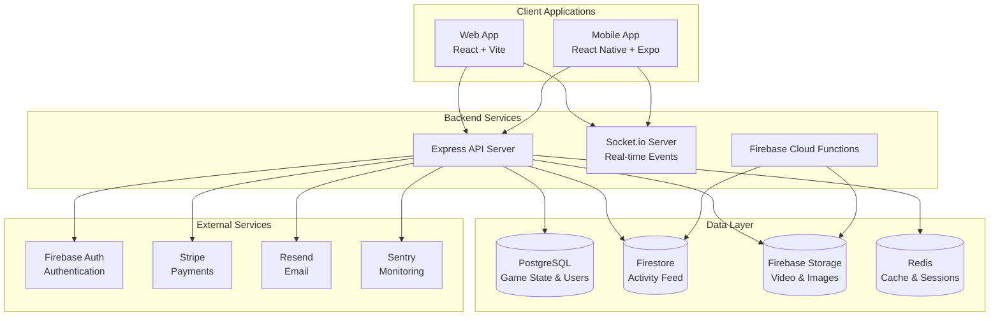

---

## S.K.A.T.E. Game Architecture

The game system is the core differentiator of SkateHubba. Here's how it works:

### Game Turn Flow

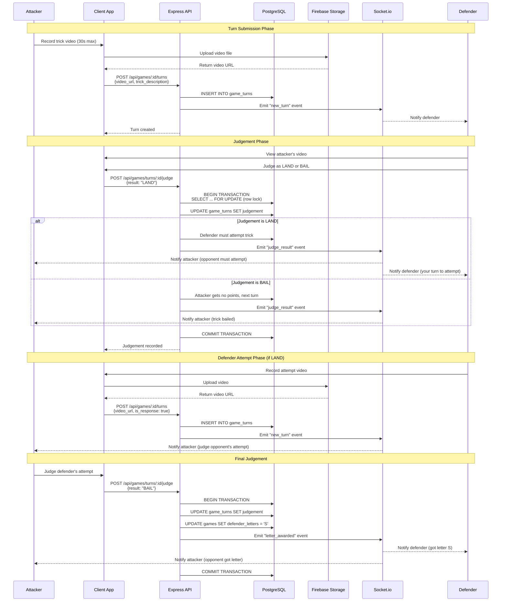

### Game State Machine

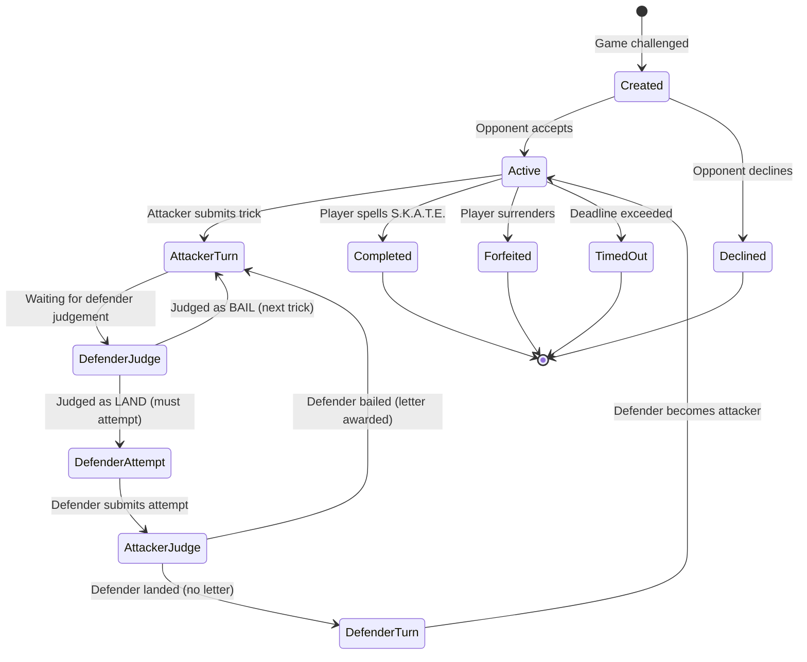

### Concurrency Control

To prevent race conditions (e.g., double-voting), we use:

1. **Row-Level Locking** in PostgreSQL:
   ```sql
   SELECT * FROM games WHERE id = $1 FOR UPDATE;
   ```

2. **Idempotency Keys** via Socket.io event IDs:
   ```typescript
   const eventId = `${userId}-${gameId}-${turnId}-${timestamp}`;
   if (processedEvents.has(eventId)) return; // Duplicate
   ```

3. **Transaction Isolation**:
   - All game state mutations happen in database transactions
   - Rollback on any failure to maintain consistency

---

## Data Flow Diagrams

### Video Upload Flow

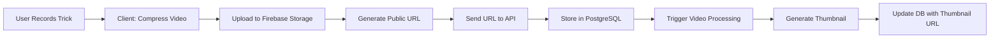

### Authentication Flow

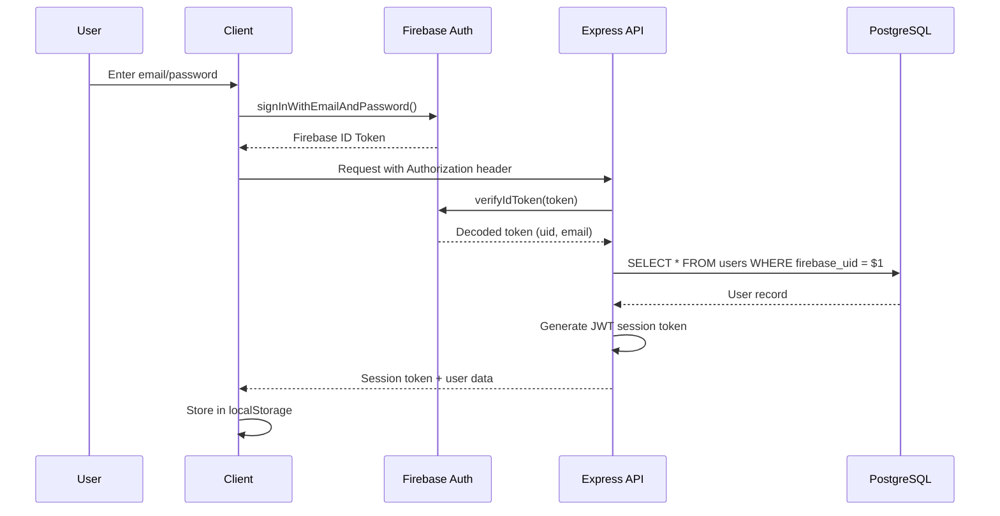

### Real-time Update Flow

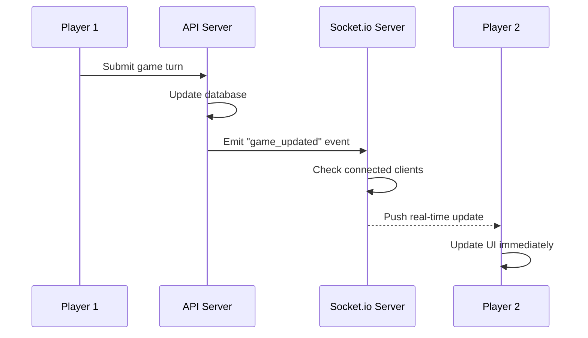

---

## Technology Stack

### Frontend (Web)
```
React 18 (UI framework)
├── Vite 5.1.2 (Build tool)
├── TypeScript 5.9.3 (Type safety)
├── TailwindCSS (Styling)
├── Radix UI (Accessible components)
├── Zustand (State management)
├── TanStack React Query (Server state)
├── React Hook Form + Zod (Forms + validation)
├── Wouter (Routing)
├── React Leaflet (Maps)
└── Socket.io Client (Real-time)
```

### Frontend (Mobile)
```
React Native + Expo
├── Expo SDK 52
├── TypeScript 5.9.3
├── React Navigation (Routing)
├── Expo Camera (Video recording)
├── Expo Location (Geolocation)
├── Expo Notifications (Push alerts)
└── Socket.io Client (Real-time)
```

### Backend
```
Express.js (API server)
├── TypeScript 5.9.3
├── PostgreSQL + pg (Database)
├── Drizzle ORM (Type-safe queries)
├── Socket.io (Real-time events)
├── Firebase Admin SDK (Auth + Storage)
├── Stripe (Payments)
├── Resend (Email)
├── fluent-ffmpeg (Video processing)
├── Winston (Logging)
└── Sentry (Error tracking)
```

### DevOps
```
pnpm (Package manager)
├── Turborepo (Monorepo builds)
├── Vitest (Unit testing)
├── Cypress (E2E testing - web)
├── Playwright (Cross-browser testing)
├── Detox (E2E testing - mobile)
├── ESLint + Prettier (Code quality)
├── Husky (Git hooks)
├── Gitleaks (Secret scanning)
└── GitHub Actions (CI/CD)
```

---

## Database Schema

### Core Tables

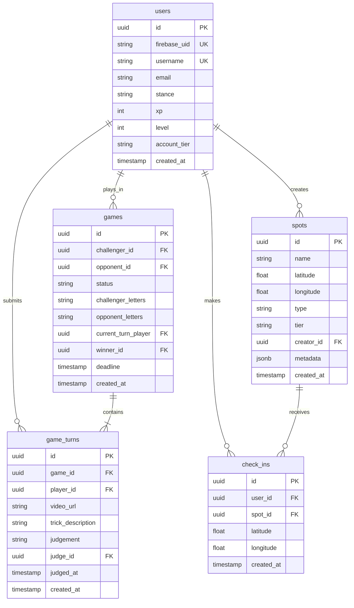

### Key Indexes

```sql
-- Game lookups by player
CREATE INDEX idx_games_challenger ON games(challenger_id);
CREATE INDEX idx_games_opponent ON games(opponent_id);
CREATE INDEX idx_games_status ON games(status);

-- Geospatial queries for spots
CREATE INDEX idx_spots_location ON spots USING GIST (
    point(longitude, latitude)
);

-- Check-in uniqueness per day
CREATE UNIQUE INDEX idx_daily_checkin
ON check_ins(user_id, spot_id, DATE(created_at));

-- Turn lookups for games
CREATE INDEX idx_game_turns_game_id ON game_turns(game_id);
CREATE INDEX idx_game_turns_player ON game_turns(player_id);
```

---

## Security Architecture

### Multi-Layer Defense

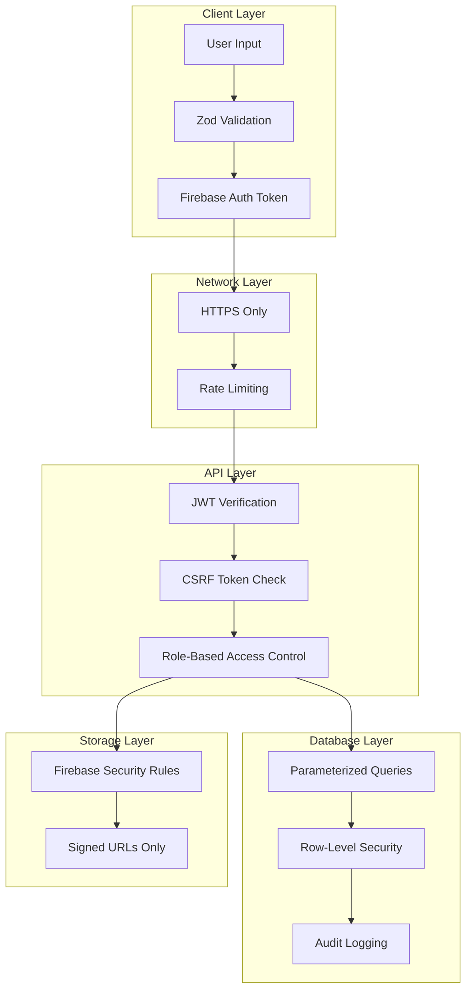

### Security Features

1. **Authentication**
   - Firebase Auth for identity management
   - JWT session tokens with expiration
   - Email verification required for posting content
   - Password reset with secure tokens

2. **Authorization**
   - Role-based access control (user, admin, pro)
   - Resource ownership checks (can only edit own content)
   - Firebase rules for Firestore and Storage

3. **Input Validation**
   - Zod schemas on client and server
   - SQL injection prevention via parameterized queries (Drizzle)
   - XSS prevention via React auto-escaping and DOMPurify

4. **Rate Limiting**
   - Global: 100 requests per 15 minutes
   - Per-user: 20 requests per minute
   - Game-specific: 1 turn per 10 seconds

5. **Secret Management**
   - Environment variables for sensitive data
   - Multi-layer secret scanning (Gitleaks, Secretlint, CI hooks)
   - JWT secret generated at runtime and persisted
   - No secrets in code or git history

6. **Monitoring**
   - Sentry error tracking
   - Audit logs for admin actions
   - Failed login attempt tracking

---

## Deployment Architecture

### Production Environment

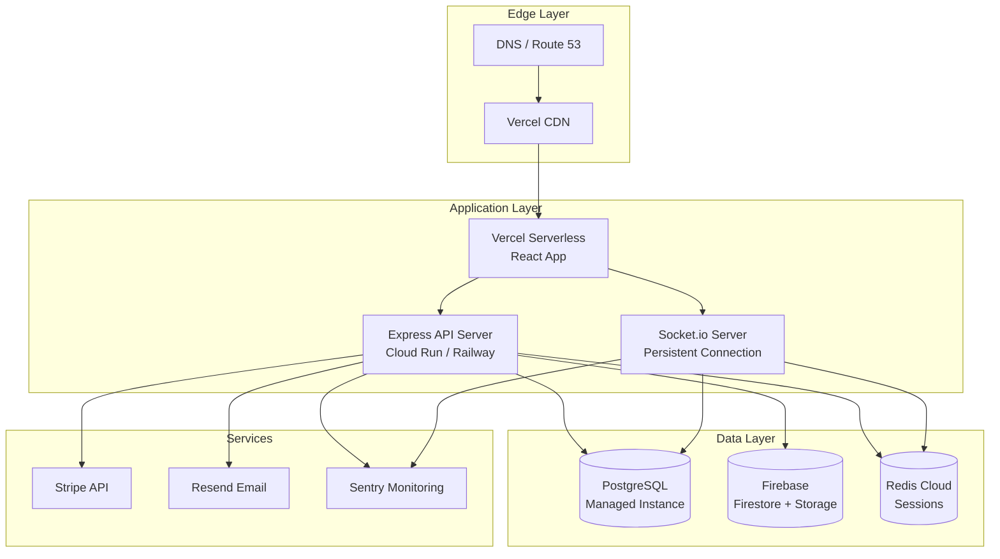

### Build Pipeline

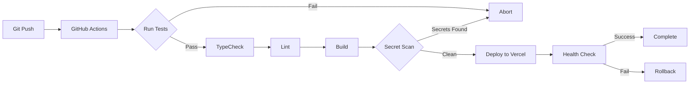

### Environment Separation

| Environment | URL | Database | Purpose |
|-------------|-----|----------|---------|
| **Local** | localhost:3000 | Local PostgreSQL | Development |
| **Staging** | staging.skatehubba.com | Staging DB | QA Testing |
| **Production** | skatehubba.com | Production DB | Live Users |

---

## Performance Optimizations

### Caching Strategy

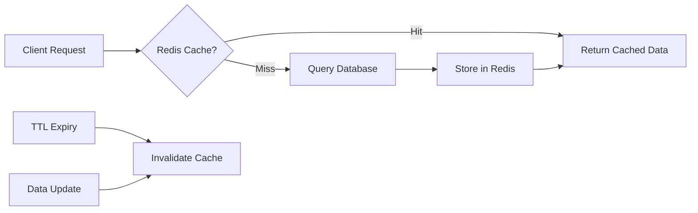

**Cached Resources:**
- Leaderboard (TTL: 60 seconds)
- User profiles (TTL: 5 minutes)
- Spot metadata (TTL: 1 hour)
- Game state (real-time, no cache)

### Database Optimizations

1. **Connection Pooling** - Reuse connections to reduce overhead
2. **Indexed Queries** - All foreign keys and frequently queried columns indexed
3. **Geospatial Indexes** - GiST indexes for location-based queries
4. **Materialized Views** - Precompute leaderboard rankings
5. **Query Optimization** - Use EXPLAIN ANALYZE to profile slow queries

### Video Delivery

1. **CDN Distribution** - Firebase Storage uses Google CDN
2. **Adaptive Streaming** - Serve different quality based on bandwidth (planned)
3. **Lazy Loading** - Load videos only when visible in viewport
4. **Thumbnail Previews** - Show thumbnails before full video loads

---

## Scalability Considerations

### Current Capacity
- **API Server:** Can handle ~1,000 concurrent users
- **Database:** PostgreSQL supports ~10,000 active games
- **Socket.io:** WebSocket server supports ~5,000 concurrent connections
- **Storage:** Firebase Storage scales automatically

### Scaling Plan

**Phase 1 (1k-10k users):**
- Vertical scaling (bigger server instances)
- Redis caching for hot data
- CDN for static assets

**Phase 2 (10k-100k users):**
- Horizontal scaling (multiple API servers behind load balancer)
- Read replicas for PostgreSQL
- Separate Socket.io cluster with sticky sessions

**Phase 3 (100k+ users):**
- Microservices architecture (separate game service, video service, etc.)
- Message queue (RabbitMQ/Kafka) for async processing
- Kubernetes for container orchestration
- Multi-region deployment for global users

---

## Related Documentation

- [Game Rules](GAME_RULES.md) - S.K.A.T.E. gameplay
- [Security](security/SECURITY.md) - Security policies
- [Deployment](DEPLOYMENT_RUNBOOK.md) - Production deployment
- [Database Migrations](../migrations/) - Schema evolution
- [API Specs](specs/) - Endpoint documentation

---

**Last Updated:** 2026-02-11
**Maintained By:** SkateHubba Engineering Team
